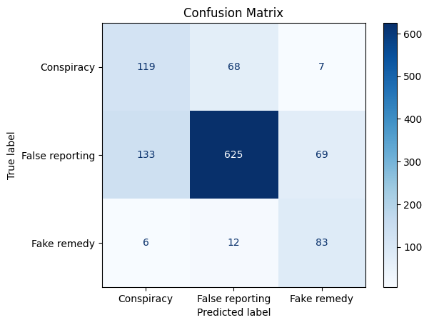
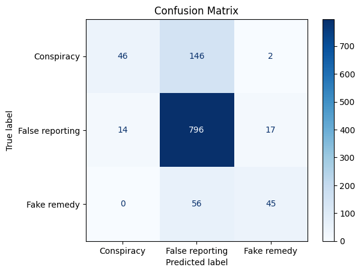
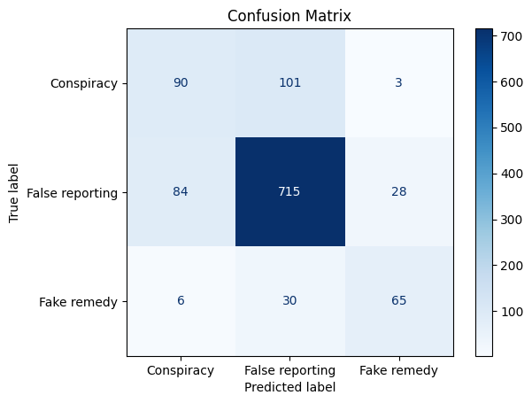
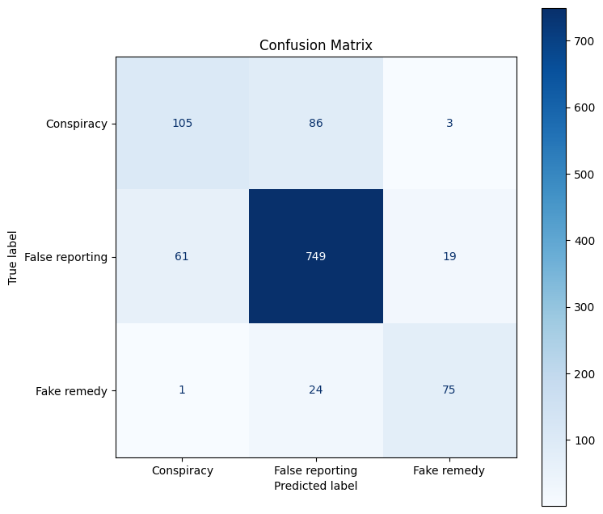
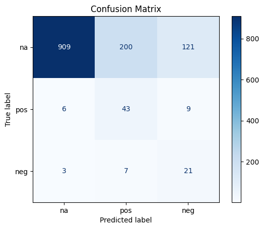
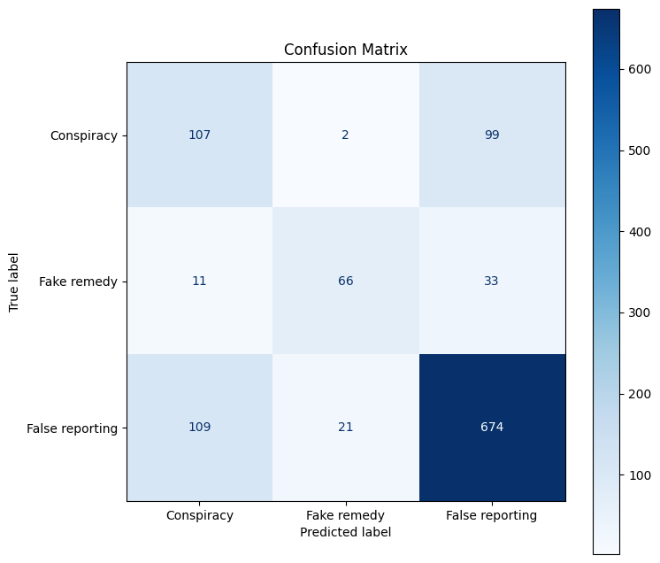
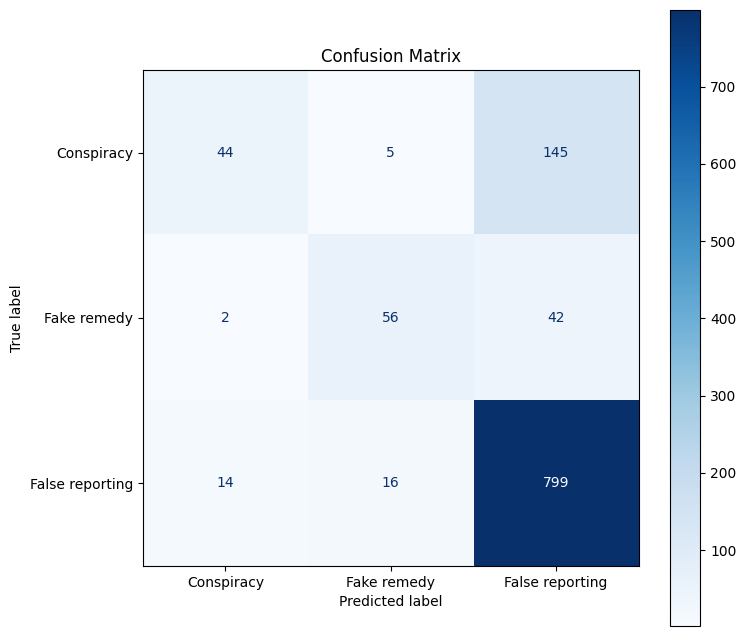

# Final Report - COVID 19 Misinformation Classification

_Final PIT for Elective 4 - DSS._

Section: 4R8

Group Members:

- Mosqueda, Christine Reisa P.
- Viernes, Jhon Lloyd D.
- Gutang, Bobby John

---

# Rationale/Background

During the peak of COVID 19, numerous news articles and academic studies have pointed out how misinformation spreads fast in the digital space. This _infodemic_ has caused distraught, confusion, and panic towards the masses, thereby necessitating for finding viable solutions to mitigate the spread of misinformation. Intriguingly, the academic and technological landscape have embraced the application of Artificial Intelligence in the intersection of healthcare and media. Such applications lead to the integration of AI in the digital space as one of the viable options for mitigating the spread of misinformation, where AI models have been deployed in the real-world industry to help combat the staggering number of misinformation in the internet. Machine Learning models like Naive Bayes, Support Vector Machines, LibLinear, and LibShortText have been utilized for classification tasks related to COVID-19 Misinformation (Cartwright, 2023).

Altogether, this project positions itself as an exploratory analysis and evaluation about the performance of different types of Machine Learning models in COVID-19 Misinformation Classification.

# Objectives

- To obtain and use existing raw datasets from reputable and credible resources.
- To clean and preprocess the obtained raw datasets.
- To train and test different text classification models (classical and deep learning) on the preprocessed dataset.
- To analyze and evaluate the performance of different models.

# Methodology

## Dataset Collection

For the dataset collection, the group had found reputable and credible dataset resources from United Nations Educational, Scientific and Cultural Organization (UNESCO) and University of California, Irvine (UCI). Both dataset consists of more than 5000 rows, which can already suffice for the training of text classification models. Imbalance in class distribution is also anticipated as in the real-world setting, as some significant classes tend to outnumber others. Both datasets are also labeled in multi-class. However, each has different scope and goal even though their use cases fall under the same genre of COVID-19 Misinformation Classification.

To compensate for the tradeoffs, each dataset were individually and separately trained on the selected models. For example, UNESCO dataset and UCI dataset were both trained on Logistic Regression in separation, which technically accounts to two models but trained on two different datasets.

This approach aims for the model training to be efficient and test the variability of the models' performance when trained and exposed to different datasets with different scopes.

## Model Selection

The group decided to explore two different types of machine learning classification models: (1) classic models, and (2) deep learning models. The performance of classic models (or traditional ML models), served as the baseline for comparing the differences of text classification models.

**Classic Models:**

- Logistic Regression
- Naive Bayes (Multinomial Naive Bayes)
- Random Forest (Ensemble)
- SVM (Linear Kernel)

**Deep Learning Models:**

- Convolutional Neural Network (in Text)
- Recurrent Neural Network
- DistilBERT (Pre-trained Transformer)

## Evaluation Metrics

Given the nature of both datasets and the anticipation of class distribution imbalance, the group has identified the **F1 Score** as the most critical metric to consider, next to Accuracy. F1 score provides a more balanced evaluation of a model's performance, especially on imbalanced datasets, by considering both precision and recall. Whereas accuracy can be misleading especially when such class was favored or outnumbers other classes, thereby only predicting the majority. Confusion matrix report were also produced and evaluated to better grasp and understand the bigger picture of the models' performance.

## Training Procedure

1. Explore and analyze the raw dataset.
2. Clean the raw dataset by applying text cleaning and preprocessing techniques on the corpus.
3. Preprocess the corpus.
4. Apply label encoding on the class labels.
5. Feature selection and extraction.
6. Text tokenization.
7. Train-test splitting.
8. Model parameter configuration.
9. Model compilation
10. Model fitting (training).
11. Evaluate model performance using metrics like f1 score, accuracy, and plotting a confusion matrix for visualization.
12. Save evaluation report and other assets like model, vectorizers, and tokenizers.

---

# Dataset Information

## UNESCO - ESOC COVID 19 Misinformation Dataset

- **Link:** [UNESCO - ESOC COVID 19 Misinformation Dataset](https://www.unesco.org/en/world-media-trends/esoc-covid-19-misinformation-dataset?fbclid=IwY2xjawOWKH1leHRuA2FlbQIxMABicmlkETFreWZKcmdmZG5icHNQNXVpc3J0YwZhcHBfaWQQMjIyMDM5MTc4ODIwMDg5MgABHpc8H5CCH3ld4rLBQvhawZv_VupMfCPHVFhWh_cYyqxvOB7v7JNmqLafClyy_aem_TXVN4cnCy4egHdiJ0rL48A)
- **About:** COVID 19 misinformation dataset collected on social media and news outlets around the world, from the early days of pandemic up to December 2020.
- **Size:** 5613 rows
- **Classification Type:** Multiclass
- **Type of data:** Qualitative
- **Type of data collection:** Crowdsourcing, experts
- **Class Distribution:**

```
False reporting - 4123
Conspiracy - 966
Fake remedy - 502
Conspiracy, False reporting - 5
False Reporting - 3
false reporting - 3
Fake remedy, false reporting - 2
False reporting, Fake remedy - 1
Conspiracy, Fake remedy - 1
Fake remedy, False reporting - 1
False reporting, Conspiracy - 1
Fake remedy, conspiracy - 1
```

- **Class Imbalance:** Highly skewed, with False reporting class outnumbering other classes. There is also an anomaly in label annotation.

## UCI Covid19-Lies

- **Link:** [UCINLP Covid19-Lies](httpsm://github.com/ucinlp/covid19-data?fbclid=IwY2xjawOWJLpleHRuA2FlbQIxMABicmlkETFreWZKcmdmZG5icHNQNXVpc3J0YwZhcHBfaWQQMjIyMDM5MTc4ODIwMDg5MgABHm6w1xZNzH_oMufcfadEBPxyGC-XRBQUoJm8O8NH9yziIIq6Diim5_-4nqlz_aem_aLfdx-XOS7RoDItT-uRKvQ)
- **About:** Misinformation dataset about misconceptions of COVID 19 collected on X (formerly Twitter).
- **Size:** 6591 rows
- **Classification Type:** Multiclass
- **Type of data:** Qualitative
- **Type of data collection:** Annotation by researchers
- **Class Distribution:**

```
na - 6149
pos - 288
neg - 154
```

- **Class Imbalance:** Highly skewed, with na (no stance) class outnumbering other classes. Labeling is clear.

# Other Strategies

- **Splitting:** Train set (80%), Test set (20%)
- **ngram range (for classical):** (1,2)
- **Random seed:** 42
- **Oversampling methods:** None / Random Oversampling / Borderline SMOTE

# Results and Discussion

## UNESCO DATASET

### Classical Models

For the UNESCO dataset, the classical models demonstrate varying levels of effectiveness in classifying misinformation into Conspiracy, Fake Remedy, and False Reporting categories. Among these, Logistic Regression achieved the most balanced and consistent performance, with an overall accuracy of 0.7825 and F1 score of 0.7826. Its precision–recall balance suggests that the model was able to generalize well across all classes, particularly excelling in the dominant class, False Reporting, while still maintaining reasonable performance in the minority classes.

Naive Bayes produced relatively strong recall values for Conspiracy and Fake Remedy, indicating its ability to detect minority class instances. However, this came at the cost of lower precision, reflecting a tendency to misclassify samples into these classes. Although still competitive with an F1 score of 0.7499, the model struggled to maintain balanced class-level performance.

Random Forest recorded a high overall accuracy of 0.7905, but its class-level results revealed substantial imbalance. While performance on the False Reporting class was strong (recall = 0.96), the recall for Conspiracy dropped significantly to 0.24. This suggests that the model overfit toward the majority class, failing to properly represent minority categories despite oversampling.

Similarly, SVM achieved a stable overall performance (accuracy = 0.7754, F1 = 0.7726) with good discrimination for the majority class. However, recall remained limited for Conspiracy (0.46) and only moderate for Fake Remedy (0.64), indicating difficulty in fully separating minority classes. Despite this, SVM maintained better balance between precision and recall compared to Naive Bayes and Random Forest.

Overall, Logistic Regression emerged as the strongest classical model due to its consistency, balanced performance across classes, and stability despite dataset imbalance.

---

**Logistic Regression**

- Overall Accuracy: 0.7825311942959001
- Overall F1 Score: 0.7826244602152056
- Classification Report:

```
Accuracy: 0.7825311942959001
F1 Score: 0.7826244602152056
                 precision    recall  f1-score   support

     Conspiracy       0.52      0.51      0.51       194
    Fake remedy       0.65      0.74      0.69       101
False reporting       0.86      0.85      0.86       827

       accuracy                           0.78      1122

      macro avg       0.68      0.70      0.69      1122
   weighted avg       0.78      0.78      0.78      1122
```

Confusion Matrix:


---

**Naive Bayes**

- Overall Accuracy: 0.7370766488413547
- Overall F1 Score: 0.7499167543070102
- Classification Report:

```
Accuracy: 0.7370766488413547
F1 Score: 0.7499167543070102
                 precision    recall  f1-score   support

     Conspiracy       0.46      0.61      0.53       194
    Fake remedy       0.52      0.82      0.64       101
False reporting       0.89      0.76      0.82       827

       accuracy                           0.74      1122
      macro avg       0.62      0.73      0.66      1122
   weighted avg       0.78      0.74      0.75      1122
```

Confusion Matrix:



---

**Random Forest**

- Overall Accuracy: 0.7905525846702317
- Overall F1 score: 0.7547009946856515
- Classification Report:

```
Accuracy: 0.7905525846702317
F1 Score: 0.7547009946856515
                 precision    recall  f1-score   support

     Conspiracy       0.77      0.24      0.36       194
    Fake remedy       0.70      0.45      0.55       101
False reporting       0.80      0.96      0.87       827

       accuracy                           0.79      1122
      macro avg       0.76      0.55      0.59      1122
   weighted avg       0.78      0.79      0.75      1122
```

Confusion Matrix:



---

**SVM**

- Overall Accuracy: 0.7754010695187166
- Overall F1 Score: 0.7726368865376482
- Classification Report:

```
Accuracy: 0.7754010695187166
F1 Score: 0.7726368865376482
                 precision    recall  f1-score   support

     Conspiracy       0.50      0.46      0.48       194
    Fake remedy       0.68      0.64      0.66       101
False reporting       0.85      0.86      0.85       827

       accuracy                           0.78      1122
      macro avg       0.67      0.66      0.67      1122
   weighted avg       0.77      0.78      0.77      1122
```

Confusion Matrix:



---

### Deep Learning Models

Deep learning models outperformed classical methods overall, with DistilBERT demonstrating the highest effectiveness. DistilBERT reached an accuracy of 0.8272 and an F1 score of 0.8234, marking it as the best-performing model on the UNESCO dataset. Its contextual embedding capability allowed it to capture nuanced linguistic patterns across misinformation categories, leading to improved recall for Fake Remedy (0.90) and False Reporting (0.75). Although performance on Conspiracy was comparatively lower, it still exceeded most classical models in precision and F1 score for this class.

The RNN model performed moderately well (accuracy = 0.7549, F1 = 0.7562). It achieved a strong recall for the majority class but struggled with minority classes. Its sequential text-processing advantage was insufficient to capture deeper contextual relationships required for fine-grained misinformation distinctions.

The CNN model showed better performance than the RNN, achieving an accuracy of 0.8005. CNNs are effective at capturing local textual patterns, which helped the model excel in identifying False Reporting (recall = 0.96). However, similar to classical models, it underperformed on Conspiracy (recall = 0.23), indicating difficulty in capturing the broader semantic context required for vague or complex misinformation claims.

Overall, the deep learning results emphasize the value of contextualized language models, particularly transformer-based architectures, for detecting nuanced misinformation. DistilBERT’s superior performance highlights that pretrained language representations are significantly more effective for this multi-class classification task than both classical and traditional deep models.

---

**DistilBERT**

- Overall Accuracy: 0.8272484416740873
- Over F1 Score: 0.8234049031174139
- Classification Report:

```
Accuracy: 0.8272484416740873
F1 Score: 0.8234049031174139
              precision    recall  f1-score   support

           0       0.63      0.54      0.58       194
           1       0.87      0.90      0.89       829
           2       0.77      0.75      0.76       100

    accuracy                           0.83      1123
   macro avg       0.76      0.73      0.74      1123
weighted avg       0.82      0.83      0.82      1123
```

Confusion Matrix:



---

**RNN**

- Overall Accuracy: 0.7549019607843137
- Over F1 Score: 0.7561978554558528
- Classification Report:

```
Accuracy: 0.7549019607843137
F1 Score: 0.7561978554558528
              precision    recall  f1-score   support

           0       0.47      0.51      0.49       208
           1       0.74      0.60      0.66       110
           2       0.84      0.84      0.84       804

    accuracy                           0.75      1122
   macro avg       0.68      0.65      0.66      1122
weighted avg       0.76      0.75      0.76      1122
```

Confusion Matrix:


---

**CNN**

- Overall Accuracy: 0.8005342831700801
- Overall F1 Score: 0.7661396563067006
- Classification Report:

```
Accuracy: 0.8005342831700801
F1 Score: 0.7661396563067006
              precision    recall  f1-score   support

           0       0.73      0.23      0.35       194
           1       0.73      0.56      0.63       100
           2       0.81      0.96      0.88       829

    accuracy                           0.80      1123
   macro avg       0.76      0.58      0.62      1123
weighted avg       0.79      0.80      0.77      1123
```

Confusion Matrix:


---

## UCI DATASET

### Classical Models

The classical machine learning models, Logistic Regression, Naive Bayes, Random Forest, and Support Vector Machine (SVM), were trained on the UCI dataset, where oversampling was applied to mitigate the significant class imbalance. The dataset originally contained a dominant majority class ("na") and two minority classes ("neg" and "pos"). Oversampling these minority classes increased their representation in the training set to improve model performance across all classes.

Overall, oversampling had mixed effects. It generally improved recall for underrepresented classes but also introduced noise, which reduced precision for some models. Logistic Regression achieved moderate accuracy (0.74) and a strong weighted F1-score (0.81). While oversampling helped it recognize minority classes better, the model still struggled with class 0, showing very low recall. Its performance on the majority class remained strong, reflecting the limits of linear decision boundaries with text-based features.

Naive Bayes showed the most pronounced effects of oversampling. It achieved extremely high precision for the majority class but very low precision for minority classes, despite having high recall for those classes. This pattern suggests that Naive Bayes overfitted to the synthetic samples generated during oversampling, likely due to its strong independence assumptions that do not align well with synthetic text distributions.

Random Forest performed more robustly, achieving 0.77 accuracy and a weighted F1-score of 0.83. The model handled oversampling better than Naive Bayes due to its ensemble nature and ability to model nonlinear relationships. However, despite these strengths, its performance on minority classes remained limited, with F1-scores around 0.26–0.30, indicating that oversampling only partially alleviated the effects of imbalance.

Among all classical models, SVM achieved the best performance, with an accuracy of 0.7733 and a weighted F1-score of 0.8321. Oversampling assisted the SVM in establishing more balanced decision boundaries across classes, leading to improved overall generalization. Nonetheless, minority-class precision and recall continued to lag behind those of the majority class, highlighting the persistent challenge posed by imbalance even after oversampling.

In summary, oversampling improved minority-class detection across all classical models, but its effectiveness varied. SVM demonstrated the strongest resilience and generalization, while Naive Bayes was the most sensitive to synthetic training samples. Logistic Regression and Random Forest performed steadily but continued to rely heavily on patterns from the majority class.

---

**Logistic Regression**

- Overall Accuracy: 0.7376800606520091
- Overall F1 Score: 0.8069614639133617
- Classification Report:

```
Accuracy: 0.7376800606520091
F1 Score: 0.8069614639133617
              precision    recall  f1-score   support

           0       0.73      0.23      0.35       194
           1       0.73      0.56      0.63       100
           2       0.81      0.96      0.88       829

    accuracy                           0.80      1123
   macro avg       0.76      0.58      0.62      1123
weighted avg       0.79      0.80      0.77      1123
```

Confusion Matrix:



---

**Naive Bayes**

- Overall Accuracy: 0.7081122062168309
- Overall F1 Score: 0.7861106512655557
- Classification Report:

```
Accuracy: 0.7081122062168309
F1 Score: 0.7861106512655557
              precision    recall  f1-score   support

          na       0.99      0.71      0.83      1230
         neg       0.11      0.68      0.19        31
         pos       0.17      0.74      0.28        58

    accuracy                           0.71      1319
   macro avg       0.42      0.71      0.43      1319
weighted avg       0.93      0.71      0.79      1319
```

Confusion Matrix:


---

**Random Forest**

- Overall Accuracy: 0.7672479150871873
- Overall F1 Score: 0.8276224421286141
- Classification Report:

```
Accuracy: 0.7672479150871873
F1 Score: 0.8276224421286141
              precision    recall  f1-score   support

          na       0.99      0.77      0.87      1230
         neg       0.16      0.68      0.26        31
         pos       0.19      0.74      0.30        58

    accuracy                           0.77      1319
   macro avg       0.45      0.73      0.47      1319
weighted avg       0.94      0.77      0.83      1319
```

Confusion Matrix:


---

**SVM**

- Overall Accuracy: 0.7733131159969674
- Overall F1 Score: 0.8321194058266828
- Classification Report:

```
Accuracy: 0.7733131159969674
F1 Score: 0.8321194058266828
              precision    recall  f1-score   support

          na       0.99      0.78      0.87      1230
         neg       0.18      0.58      0.28        31
         pos       0.17      0.74      0.28        58

    accuracy                           0.77      1319
   macro avg       0.45      0.70      0.48      1319
weighted avg       0.93      0.77      0.83      1319
```

Confusion Matrix:


---

### Deep Learning Models

The deep learning models—DistilBERT, RNN, and TextCNN—demonstrated stronger performance than the classical approaches due to their ability to learn contextual and sequential representations from text. Although oversampling was applied, these models were generally less affected by synthetic noise compared to classical TF-IDF–based models.

DistilBERT achieved the best overall performance (Accuracy: 0.83, F1: 0.82), showing strong precision and recall for the majority class while maintaining comparatively balanced results across minority classes. Its contextual embeddings allowed it to capture subtle semantic distinctions, reducing misclassification patterns observed in other models.

The RNN performed moderately (Accuracy: 0.75, F1: 0.76). While it captured sequential dependencies effectively, its performance on minority classes remained limited, reflecting challenges in modeling long-range context without transformer-level representation capacity.

TextCNN achieved competitive accuracy (0.80) and a weighted F1-score of 0.77. It performed well on the majority class but struggled with minority-class recall, suggesting that its reliance on local n-gram patterns makes it more sensitive to oversampling noise and limited minority-class variation.

Overall, DistilBERT showed the most robust and balanced performance, confirming the advantage of transformer-based architectures for stance classification under imbalanced datasets.

---

**DistilBERT**

- Overall Accuracy: 0.8272484416740873
- Overall F1 Score: 0.8234049031174139
- Classification Report:

```
Accuracy: 0.8272484416740873
F1 Score: 0.8234049031174139
              precision    recall  f1-score   support

           0       0.63      0.54      0.58       194
           1       0.87      0.90      0.89       829
           2       0.77      0.75      0.76       100

    accuracy                           0.83      1123
   macro avg       0.76      0.73      0.74      1123
weighted avg       0.82      0.83      0.82      1123
```

Confusion Matrix:


---

**RNN**

- Overall Accuracy: 0.7549019607843137
- Overall F1 Score: 0.7561978554558528
- Classification Report:

```
Accuracy: 0.7549019607843137
F1 Score: 0.7561978554558528
              precision    recall  f1-score   support

           0       0.47      0.51      0.49       208
           1       0.74      0.60      0.66       110
           2       0.84      0.84      0.84       804

    accuracy                           0.75      1122
   macro avg       0.68      0.65      0.66      1122
weighted avg       0.76      0.75      0.76      1122
```

Confusion Matrix:



---

**CNN**

- Overall Accuracy: 0.8005342831700801
- Overall F1 Score: 0.7561978554558528
- Classification Report:

```
Accuracy: 0.8005342831700801
F1 Score: 0.7661396563067006
              precision    recall  f1-score   support

           0       0.73      0.23      0.35       194
           1       0.73      0.56      0.63       100
           2       0.81      0.96      0.88       829

    accuracy                           0.80      1123
   macro avg       0.76      0.58      0.62      1123
weighted avg       0.79      0.80      0.77      1123
```

Confusion Matrix:



---

# Conclusion

The project demonstrated that deep learning models, particularly transformer-based architectures, significantly outperform classical machine learning approaches in text classification tasks involving imbalanced datasets. While classical models benefited from oversampling, their performance remained constrained by limited feature representations and sensitivity to synthetic data. In contrast, the deep learning models—especially DistilBERT—achieved superior accuracy, F1-scores, and more balanced class-wise performance due to their ability to learn contextual and semantic patterns directly from raw text. These findings highlight the effectiveness of transformer models for capturing nuanced linguistic features and underscore their suitability for misinformation and stance classification tasks.

---

# References

- Cartwright, B., Frank, R., Weir, G., Padda, K., & Strange, S.-M. (2023). Deploying Artificial Intelligence to Combat Covid-19 Misinformation on Social Media: Technological and Ethical Considerations. Proceedings of the ... Annual Hawaii International Conference on System Sciences/Proceedings of the Annual Hawaii International Conference on System Sciences. https://doi.org/10.24251/hicss.2023.266

‌
